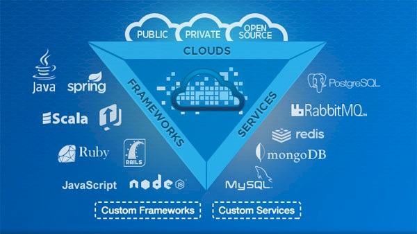
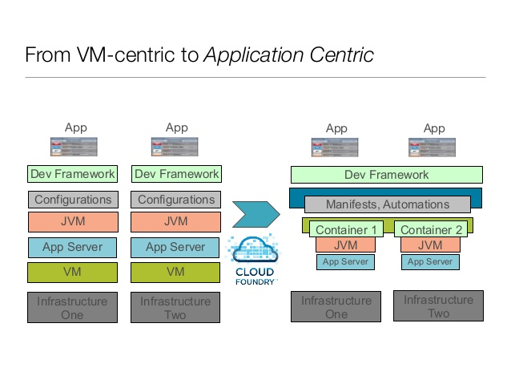

# Using Cloud Foundry

## Introduction

### Overview

Cloud Foundry is an open source PaaS which provides a layer of abstraction on top of an IaaS (such as AWS or VMWare vCloud), serving as a ready-made platform for deploying and running applications.

In addition, Cloud Foundry offers out of the box support for many different languages, frameworks, technologies, and services, along with the flexibility to be extended to support custom runtimes and services.



### Why Cloud Foundry?

In VM centric deployments, applications are deployed on an IaaS. When deploying directly onto an IaaS, you must take extra caution to ensure that your infrastructure is set up with an appropriate VM, Runtime (JVM), application server, and then finally your application.

In application centric deployments, applications are deployed on a PaaS. You can rely on the PaaS to set up the infrastructure bits of your deployment (VM, JVM, app server) allowing you to focus solely on the deployment of your application.

Cloud Foundry shifts the focus of deployment from VM centric to application centric.



For more details on open source Cloud Foundry, refer to the [online documentation](http://docs.cloundfoundry.org).

## Cloud Foundry Blueprint

### Getting Familiar with CF Vocabulary

#### Organizations

* Top-most organization unit (e.g. company, department, etc.)
* Within an organization, you will set up users, spaces, and domains
* Where you define routes, apps, and services

#### Spaces

* CF allows you to defines spaces for your apps to run in
* Default spaces that you get if you run in run.pivotal.io are: `development`,  `staging`, and `production`
* You can create additional spaces, and define their permissions for access

#### Services

* A type of add-on resource that you would look your Cloud Foundry to provision alongside your application (i.e. databases, messaging queues, file systems)
* Usually provided by a third party SaaS provider
* Usually bound to one or more applications


## Prerequisites

### Required

* Setup a Pivotal Web Services trial account
* Install the Cloud Foundry Command Line Interface

### Optional 

#### Installing and Setting Up Spring Tool Suite

1. Install [Spring Tool Suite](http://spring.io/tools/sts)

2. Install Cloud Foundry Integration with STS    
    * Within STS, go to `Help > Install New Software` and search for "Cloud Foundry". Install the two packages that appear (`Core / Cloud Foundry Integration` and `Resources / Cloud Foundry Integration`). Note that the install process may take a while, and STS will need to be restarted for the changes to take effect.
    
3. Import projects into STS
    * Install samples and partially-completed projects into your workspace. Run the following command in your Mac OS X Terminal:
    ```
	git clone https://github.com/s2edu/cloudfoundrystudentfiles
    ```
    
    * From the project explorer, right click: `Import > Maven > Existing Maven Projects`
	
    * Navigate to the folder where you extracted the student files (step 3a) and Finish. Note that depending on the version of STS / Eclipse, your version of Java, and other factors, you may encounter errors.  These will need to be fixed on a case-by-case basis. This may take a while.


## What is Pivotal Cloud Foundry?

PCF is an enterprise PaaS powered by open-sourc CF. The purpose of PCF is to provide a turnkey experience catered towards private cloud use. PCF can be deployed publicly (on [PWS](run.pivotal.io)), but it was originally designed for enterprises looking to run a private CF instance. PCF enables enterprises to significantly speed up application and data services delivery.


PCF can be used:

* Publicly (on [Pivotal Web Services](run.pivotal.io)). More information about running on PWS is available in the [online documentation](http://docs.run.pivotal.io)
* In-house as the basis of your private cloud
* On a third-party cloud provider (such as Open Stack or AWS)

For more details on Pivotal Cloud Foundry, refer to the [online documentation](http://docs.gopivotal.com/pivotalcf)
